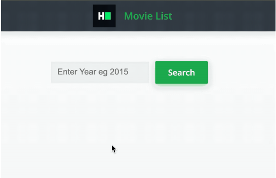

## React movie list

Create a movie list component, as shown below.



The component must have the following functionalities:

- The input should initially be empty. The user can type a year in this
input box to search for movies released in that year.
- Clicking on the 'Search' button should make an API GET call to URL
'https://jsonmock.hackerrank.com/api/movies?Year={input}' using
the JavaScript Fetch API, specifically the fetch function. Here,
{input} is the number entered in text box. For example, for value
2015, the API hit has to
be https://jsonmock.hackerrank.com/api/movies?Year=2015
- The response contains a data field where data is an array of objects,
where each object is a movie record. Sample format of data field is
given below- 
    ```
    "data": [
      {
        "Title": "The Death of Spiderman",
        "Year": 2015,
        "imdbID": "tt5921428"
      },
      {
        "Title": "Beat Feet: Scotty Smiley's Blind Journey to Ironman",
        "Year": 2015,
        "imdbID": "tt5117146"
      }
    ]
    ```
- Each movie record contains a Title field. Retrieve all the movies
from the response and for each movie record display the Title as
`<li>{title}</li>` inside `<ul data-testid="movieList"></ul>`, in the order
they appear in the data field.
- If there are no movies returned for the year by the API, you must
render `<div data-testid="no-result">No Results Found</div>` instead,
and this element must be visible only when the data field is an
empty array. This div should not be rendered initially since no API
has been hit yet.
- Please note that the input field accepts only numbers. Test cases
take care of calling the API with valid input, so writing any input
validation is not required.
- For testing purposes, please use the following year values - '2015'
and '2016'

The following data-testid attributes are required in the component for
the tests to pass:
- Input should have the data-testid attribute 'app-input'.
- Button should have the data-testid attribute 'submit-button'.
- `<ul>` should have data-tested attribute 'movieList'.
- The 'No Results Found' div should have the data-testid attribute
'no-result'.

Please note that components have certain data-testids for test cases
and classes and ids for rendering purposes. It is advised not to change
them.
